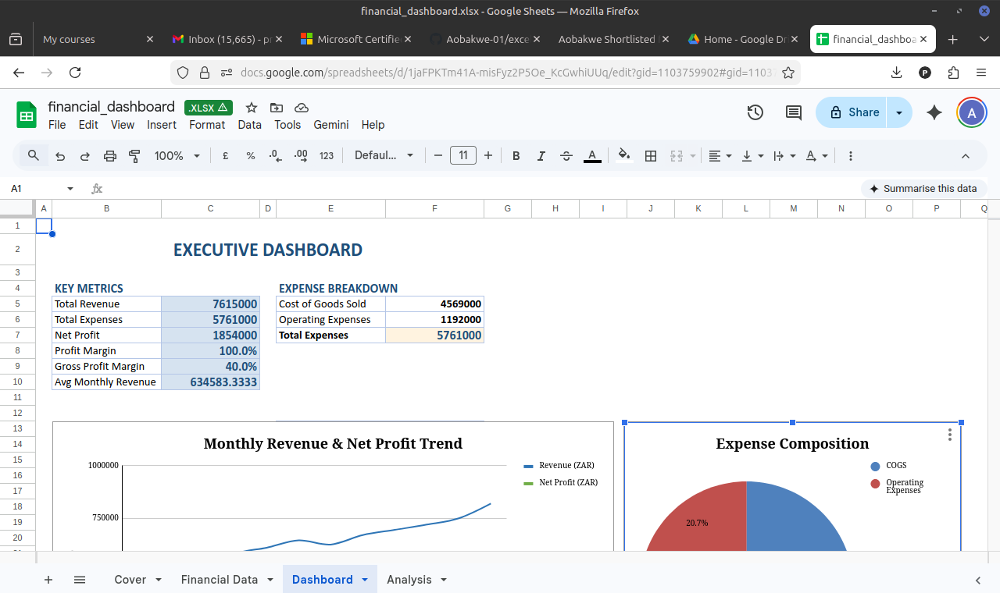

# excel-financial-dashboard
Interactive Excel dashboard with automated KPIs, MoM growth analysis, and business intelligence features
# Financial Analytics Dashboard

An interactive Excel dashboard built to demonstrate data analysis and business intelligence skills.

## 📊 Features
- Automated KPI calculations (Revenue, Expenses, Profit, Margins)
- Month-over-Month growth analysis
- Conditional performance ratings using IF logic
- Statistical analysis including standard deviation
- Dynamic expense breakdown with INDEX/MATCH functions

## 📁 Files
- `financial_dashboard.xlsx` - Main dashboard file
- `dashboard_preview.png` - Screenshot of the dashboard

## 🛠️ Skills Demonstrated
- Excel formulas (SUM, AVERAGE, STDEV, IF, INDEX/MATCH)
- Data visualization and dashboard design
- Business metrics and KPI development
- Automated reporting systems

## 👨‍💻 About Me
I'm a data analyst passionate about transforming raw data into actionable insights.

## 📸 Preview

